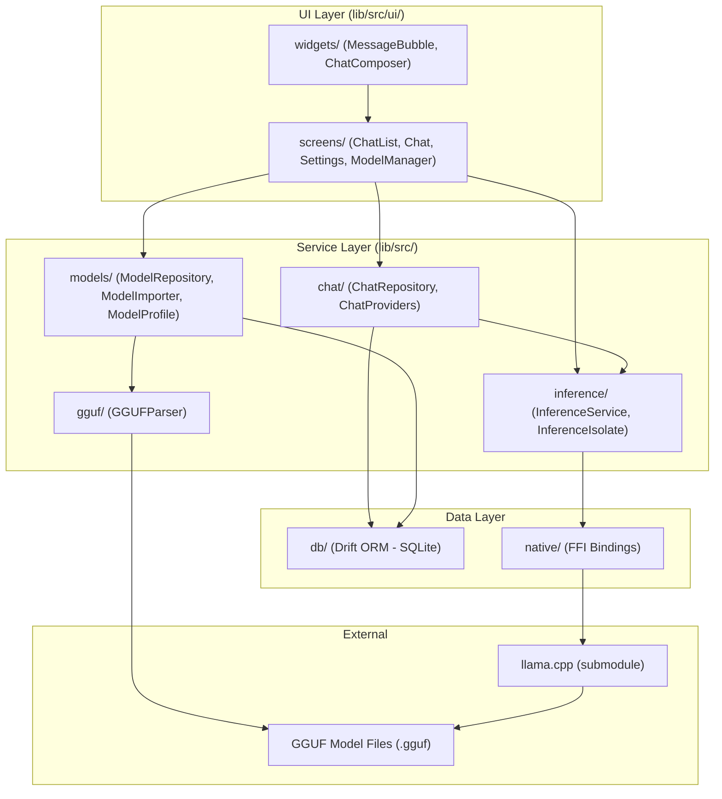

# Architecture

## Data Flow

1. **Model Import**: User picks a `.gguf` file from disk → `ModelImporter` copies it to app-private storage → `ModelRepository` indexes it → metadata parsed via `GGUFParser` → persisted in SQLite via Drift.
2. **Inference**: User sends a message → `ChatRepository` formats the prompt using `ChatTemplate` → `InferenceService` sends an `InferenceCommand` → `InferenceIsolate` processes it in a background isolate → native FFI bindings call into llama.cpp → tokens stream back as `InferenceEvent`s.
3. **Persistence**: Conversations and messages stored in SQLite via Drift ORM. Full-text search (FTS5) on message content for search.

## Key Design Decisions

- **Background Isolate**: All LLM inference runs in a separate Dart isolate to keep the UI responsive.
- **FFI**: Direct bindings to llama.cpp via `dart:ffi` for maximum inference performance.
- **Drift ORM**: Type-safe database access with migrations; schema defined in `database.dart`.
- **Riverpod**: Reactive state management; providers auto-dispose when no longer listened to.
